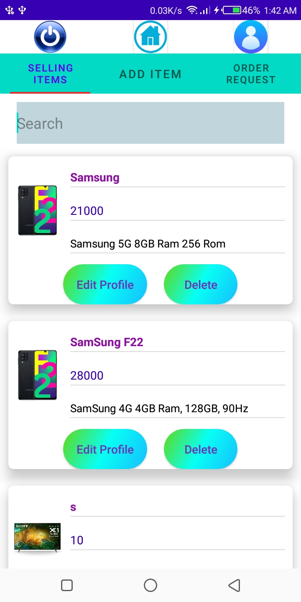

# E-commerce-Mobile-app

The main goal of my mobile app to Selling a Item like electronic, mobile, etc.., User can purchase items using my platform and seller can sell their product.

In app user can do multiple task he/she can view product, add item in bucket, place order, track order. Seller can manage users and order tracking. Admin handle new seller add and manage all Activity.
Developed this mobile app using android, java, xml design, firebase database.

